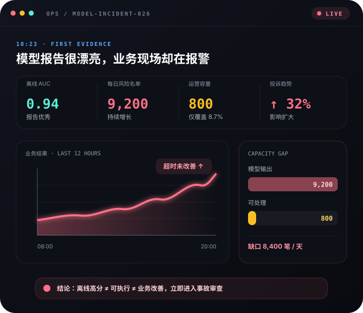

# 数据分析师面试与业务实战手册

> 在真实业务问题中练习定义问题、寻找证据、做出判断，并把结论讲清楚。

[系统课程](https://silentglow.github.io/analyst-handbook/courses.html) · [专题课程](https://silentglow.github.io/analyst-handbook/topics/) · [业务案例](https://silentglow.github.io/analyst-handbook/stories/)

## 这是什么

这是一套面向数据分析学习者和求职者的开放式静态课程。系统课程、专题课程与业务案例共同训练可迁移的分析能力：

- **课程建立框架**：从指标、异动、实验到面试表达，形成完整分析主线；
- **专题讲透方法**：围绕业务分析、指标异动、机器学习、A/B 测试、游戏商业化、异常订单、广告投放和分析报告，把原理、过程、失败边界与面试问答放在同一节课中；
- **案例训练判断**：进入有角色、目标、数据与冲突的业务现场，先选择，再复盘；
- **速览帮助复习**：在面试前快速回顾核心框架、90 秒回答和常见失分点。

目前包括 **24 章核心课程、4 章机器学习扩展、10 节专题课程和 26 个业务故事**，支持桌面端与手机端阅读。

## 学习地图

| 阶段 | 你要解决的问题 | 主要内容 |
|---|---|---|
| 01 · 完成第一场业务分析 | 怎样从一个模糊现象走到可执行方案？ | 指标体系、异动排查、A/B 实验、策略落地 |
| 02 · 高频分析工具箱 | 面对不同问题，应该选什么方法？ | 用户分层、留存、预测、统计、因果与商业模式 |
| 03 · 把分析变成面试答案 | 会分析，怎样让面试官听懂并相信？ | 自我介绍、项目表达、指标题、异动题与费米估算 |
| 04 · 模拟面试与职业迁移 | 遇到陌生行业和追问，怎样稳定发挥？ | 完整模拟、策略评估、SQL 与行业迁移 |
| 05 · 机器学习：先判断，再建模 | 什么时候需要模型，什么时候应该拒绝？ | 问题审查、履约风险、需求预测与模型失败复盘 |

## 选择适合你的学习方式

### 第一次系统学习

从[课程首页](https://silentglow.github.io/analyst-handbook/courses.html)开始，按五个阶段依次学习。先建立完整分析框架，再根据自己的薄弱点选择专题或业务案例，不必一次读完全部内容。

### 面试前快速复习

进入任意章节后切换到“面试速览”，重点检查三件事：

1. 能否独立说出分析框架；
2. 能否在 90 秒内讲清业务判断；
3. 能否主动说明假设、风险和下一步行动。

### 按专题深入

[专题课程](https://silentglow.github.io/analyst-handbook/topics/)集中处理十类典型问题：业务分析方法、指标异动、机器学习从 0 到 1、通用机器学习流水线、KMeans、A/B 测试、游戏商业化、异常订单、广告投放与分析报告。每节课都包含过程演示、完整解释、失败案例和面试问答。

### 学习机器学习业务应用

建议依次学习 [问题审查](https://silentglow.github.io/analyst-handbook/articles/ml01.html)、[履约风险](https://silentglow.github.io/analyst-handbook/articles/ml02.html)、[需求预测](https://silentglow.github.io/analyst-handbook/articles/ml03.html)和[模型失败复盘](https://silentglow.github.io/analyst-handbook/articles/ml04.html)，最后完成案例：[0.94 分的模型，为什么被叫停？](https://silentglow.github.io/analyst-handbook/stories/model-score-trap.html)

机器学习部分从业务对象、决策时点、可执行动作和错误成本开始，再判断规则、实验、分析或模型哪一种方案更合适。案例覆盖履约风险、需求预测、游戏商业化、异常订单和广告投放。

## 在案例里练什么

业务案例要求学习者亲自查看证据、选择方向并完成复盘。例如：

- [GMV 涨了，利润为什么反而降低？](https://silentglow.github.io/analyst-handbook/stories/gmv-up-profit-down.html)
- [转化率跌了，问题究竟在哪里？](https://silentglow.github.io/analyst-handbook/stories/conversion-rate-drop.html)
- [优惠券带来的是真增量，还是补贴了自然转化？](https://silentglow.github.io/analyst-handbook/stories/coupon-incrementality.html)
- [双十一 GMV 达标，就代表活动成功了吗？](https://silentglow.github.io/analyst-handbook/stories/double-eleven-review.html)
- [模型分数很漂亮，为什么上线后却被紧急叫停？](https://silentglow.github.io/analyst-handbook/stories/model-score-trap.html)

[](https://silentglow.github.io/analyst-handbook/stories/model-score-trap.html)

每个故事都尽量让你经历“看到现象—提出假设—选择证据—形成动作—复盘错误”的完整过程。错误选项也会说明为什么看似合理、又为什么可能把分析带偏。

## 课程体验

- **完整学习 / 面试速览双模式**：分别服务于理解、推导和临场复习；
- **三类内容各司其职**：系统课程建立主线，专题课程讲透方法，业务案例训练判断；
- **真实失败案例**：不仅讲成功方案，也拆解目标、数据、验证、行动和环境层面的失败；
- **克制的教学视觉**：只在过程、结构或状态变化难以用文字讲清时使用图解和动画；
- **纯静态、响应式页面**：页面可直接发布到 GitHub Pages，并适配手机与电脑。

## 在本地阅读

仓库已经包含生成好的页面。下载项目后，在项目目录启动一个本地服务：

```bash
python3 -m http.server 8765 --bind 127.0.0.1
```

然后打开 `http://127.0.0.1:8765/`。普通学习者不需要运行构建脚本。

## 参与维护

如果你要修改课程或增加新知识，请优先编辑内容源，而不是直接修改生成页面：

- 课程正文：`content/`
- 故事正文：`story-src/`
- 专题正文：`topics-src/`
- 课程、故事与专题信息：`chapters.json`、`stories.json`、`topics.json`
- 样式系统：`assets/css/`(按 `tokens → base → components → page-*` 分层,`tokens.css` 是全站唯一的颜色、字号与身份色来源:课程=蓝、专题=紫、案例=橙)
- 交互脚本与教学图:`assets/*.js`、`assets/visuals/`

`assets/app.css` 与 `assets/story.css` 由构建器打包生成(链接中的 `?v=` 为内容 hash),请勿手工编辑。

修改完成后运行：

```bash
python3 build.py
```

`index.html`、`home.html`、`courses.html`、`articles/`、`topics/`、`stories/` 中的页面以及 `assets/app.css`、`assets/story.css` 两个样式包会由构建器统一生成。关于新内容应该写成课程、故事、知识卡还是练习，以及机器学习案例的准入规则，请阅读 [CONTENT_GUIDE.md](CONTENT_GUIDE.md)。

## 内容原则

1. **先定义问题，再选择方法。**
2. **先给证据，再下结论。**
3. **先做业务判断，再讨论模型分数。**
4. **成功与失败都应当成为正式教材。**
5. **视觉必须帮助理解，而不只是让页面更热闹。**
6. **最终产出应当能被表达、被执行，也能被验证。**
